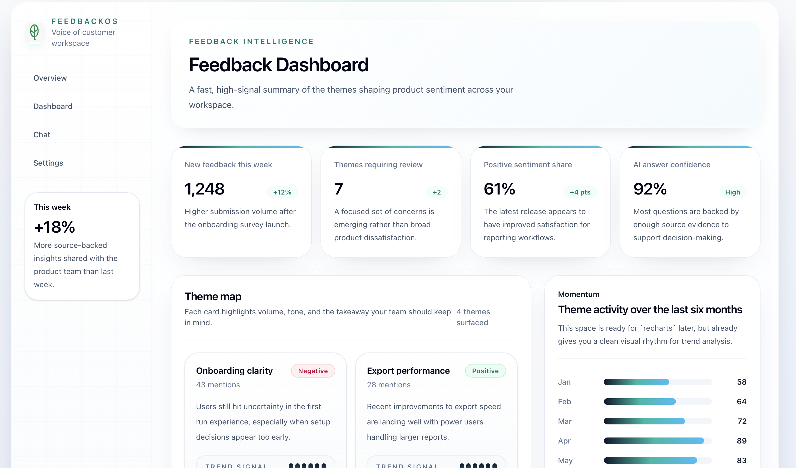

# 🚀 FeedbackOS — AI-Powered Customer Feedback Intelligence Platform

## 🌐 Live Demo

Product: [https://feedbackos-ameer5511s-projects.vercel.app/](https://feedbackos-ameer5511s-projects.vercel.app/)

---

## 📌 Overview

FeedbackOS is a production-ready SaaS platform that transforms unstructured customer feedback into actionable product insights using AI.

It ingests feedback from multiple sources, processes it using embeddings and LLMs, and outputs themes, answers, and automated weekly insights.

---

## 🛠️ Tech Stack


---

## 🎯 Key Features

* Multi-source feedback ingestion (CSV, text, webhook)
* AI-based theme detection
* Semantic search using vector embeddings
* RAG-based chat interface
* Weekly AI-generated insights via email
* Multi-workspace SaaS architecture

---

## 🏗️ Architecture

```text
User Input
   ↓
FastAPI Backend
   ↓
Supabase Database
   ↓
HuggingFace Embeddings
   ↓
pgvector Search
   ↓
Groq LLM Processing
   ↓
Frontend Dashboard / Chat / Email
```

---
---

## 📸 Screenshots

### Page


### Dashboard


---

## 📂 Project Structure

```text
feedbackos/
│
├── backend/
│   ├── routers/
│   ├── services/
│   ├── models/
│   ├── db/
│   └── main.py
│
├── frontend/
│   ├── app/
│   └── components/
│
└── README.md
```

---

## 🔄 Core Workflow

* Ingest feedback
* Chunk and clean data
* Generate embeddings
* Store in vector DB
* Detect themes using LLM
* Enable Q&A via RAG
* Send weekly digest

---

## 🔐 License

```
Copyright (c) 2026 Ameer Muhammed

All rights reserved.

This repository contains proprietary software developed for a commercial SaaS product.

Unauthorized copying, modification, distribution, or use of this software is strictly prohibited.
```

---

## 💼 Commercial Intent

Designed as a scalable SaaS product for:

* SaaS founders
* Product managers
* Customer success teams
* Agencies managing multiple clients

---

## 🧠 Highlights

* End-to-end AI system (not just UI)
* Production-grade backend + async processing
* Real-world SaaS use case
* Vector DB + RAG implementation
* Fully deployed system

---

## 👨‍💻 Author

**Ameer Muhammed**
| Software engineer
| 🔗 LinkedIn: [https://www.linkedin.com/in/ameer-muhammed55/](https://www.linkedin.com/in/ameer-muhammed55/)

---

## ⭐ Final Note

This project demonstrates the ability to design, build, and deploy a full-scale AI-powered SaaS system using modern technologies and scalable architecture.


